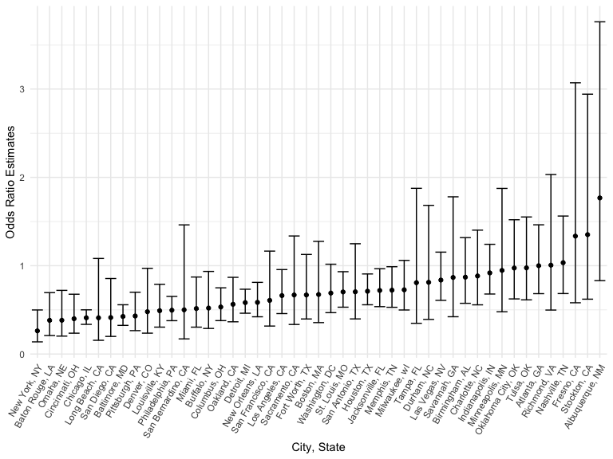
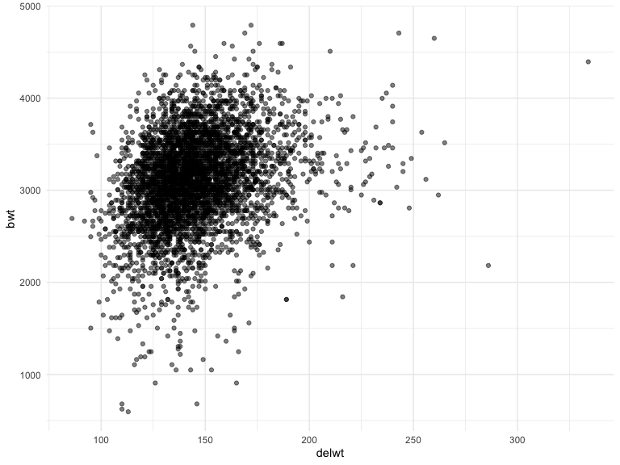

Homework 6
================
Emma Sexton
Due 3 Dec 2022

``` r
library(tidyverse)
library(modelr)
```

## Problem 1

To obtain a distribution for $\hat{r}^2$, we’ll follow basically the
same procedure we used for regression coefficients: draw bootstrap
samples; the a model to each; extract the value I’m concerned with; and
summarize. Here, we’ll use `modelr::bootstrap` to draw the samples and
`broom::glance` to produce `r.squared` values.

``` r
weather_df = 
  rnoaa::meteo_pull_monitors(
    c("USW00094728"),
    var = c("PRCP", "TMIN", "TMAX"), 
    date_min = "2017-01-01",
    date_max = "2017-12-31") %>%
  mutate(
    name = recode(id, USW00094728 = "CentralPark_NY"),
    tmin = tmin / 10,
    tmax = tmax / 10) %>%
  select(name, id, everything())
```

    ## Registered S3 method overwritten by 'hoardr':
    ##   method           from
    ##   print.cache_info httr

    ## using cached file: ~/Library/Caches/R/noaa_ghcnd/USW00094728.dly

    ## date created (size, mb): 2022-09-29 11:01:00 (8.401)

    ## file min/max dates: 1869-01-01 / 2022-09-30

## Problem 2

``` r
homicide_df <- 
  read_csv(
    'data/homicide-data.csv') %>%  
  janitor::clean_names()
```

    ## Rows: 52179 Columns: 12
    ## ── Column specification ────────────────────────────────────────────────────────
    ## Delimiter: ","
    ## chr (9): uid, victim_last, victim_first, victim_race, victim_age, victim_sex...
    ## dbl (3): reported_date, lat, lon
    ## 
    ## ℹ Use `spec()` to retrieve the full column specification for this data.
    ## ℹ Specify the column types or set `show_col_types = FALSE` to quiet this message.

``` r
homicide_summary <- 
  homicide_df %>% 
  mutate(
    city_state = str_c(city, sep = ", ", state),
    victim_age = as.numeric(victim_age),
    hom_solved = ifelse(disposition == "Closed by arrest", 1, 0)
  ) %>%
  filter(!(city_state %in% c("Tulsa, AL", "Dallas, TX", "Phoenix, AZ", "Kansas City, MO")),
         victim_race %in% c("White", "Black"))
```

### Run logistic regression for Baltimore, MD

``` r
baltimore_glm_df <- homicide_summary %>% 
  filter(city_state == "Baltimore, MD")

baltimore_glm_results <- 
  baltimore_glm_df %>% 
  glm(hom_solved ~ victim_age + victim_sex + victim_race, data = ., family = binomial())

baltimore_glm_results %>% 
  broom::tidy() %>% 
  mutate(odds_ratio = exp(estimate),
         lower_ci = exp(estimate - 1.96*std.error),
         upper_ci = exp(estimate + 1.96*std.error)
         ) %>% 
  select(term, odds_ratio, lower_ci, upper_ci) %>% 
  filter(term == "victim_sexMale") %>% 
  knitr::kable(col.names = c("Term", "Odds Ratio", "Lower 95% CI", "Upper 95% CI"), digits = 3)
```

| Term           | Odds Ratio | Lower 95% CI | Upper 95% CI |
|:---------------|-----------:|-------------:|-------------:|
| victim_sexMale |      0.426 |        0.325 |        0.558 |

### Run logistic regression for all City, States

We need to create a function to iterate across each `city_state` group.

``` r
glm_homicide <- function(homicide_summary) {
  
  glm(hom_solved ~ victim_age + victim_sex + victim_race, data = homicide_summary, family = binomial()) %>% 
    broom::tidy() %>% 
    mutate(
      odds_ratio = exp(estimate),
      lower_ci =   exp(estimate - 1.96*std.error),
      upper_ci =   exp(estimate + 1.96*std.error)
    ) %>% 
    select(term, odds_ratio, lower_ci, upper_ci) %>% 
    filter(term == "victim_sexMale")
  
}
```

Now we need to apply that function to nested lists for each
`city_state`.

``` r
homicide_data_analysis <- 
  homicide_summary %>% 
  select(city_state, everything()) %>% 
  nest(data = uid:hom_solved) %>% 
  mutate(glm_homicide_output = purrr::map(.x = data, ~ glm_homicide(.x))) %>% 
  unnest(cols = glm_homicide_output)
```

### Plot OR’s and CI’s for each City, State

``` r
homicide_data_analysis %>%
  ggplot(aes(x = reorder(city_state, odds_ratio), y = odds_ratio)) +
  geom_point() +
  geom_errorbar(aes(ymin = lower_ci, ymax = upper_ci)) +
  labs(
    title = , 
    x = "City, State",
    y = "Odds Ratio Estimates"
  ) +
  theme(
    axis.text.x = element_text(angle = 60, hjust = 1),
    legend.position = "none"
  )
```



## Problem 3

### Load and clean data for regression analysis

``` r
birthweight_df <- 
  read_csv(
    'data/birthweight.csv') %>%  
  janitor::clean_names() %>%
  mutate(
    babysex = factor(babysex, labels = c("male", "female")),
    frace = factor(frace, labels = c("white", "black", "asian", "puerto rican", "other")),
    malform = factor(malform, labels = c("absent", "present")),
    mrace = factor(mrace, labels = c("white", "black", "asian", "puerto rican"))
  )
```

    ## Rows: 4342 Columns: 20
    ## ── Column specification ────────────────────────────────────────────────────────
    ## Delimiter: ","
    ## dbl (20): babysex, bhead, blength, bwt, delwt, fincome, frace, gaweeks, malf...
    ## 
    ## ℹ Use `spec()` to retrieve the full column specification for this data.
    ## ℹ Specify the column types or set `show_col_types = FALSE` to quiet this message.

``` r
skimr::skim(birthweight_df)
```

|                                                  |                |
|:-------------------------------------------------|:---------------|
| Name                                             | birthweight_df |
| Number of rows                                   | 4342           |
| Number of columns                                | 20             |
| \_\_\_\_\_\_\_\_\_\_\_\_\_\_\_\_\_\_\_\_\_\_\_   |                |
| Column type frequency:                           |                |
| factor                                           | 4              |
| numeric                                          | 16             |
| \_\_\_\_\_\_\_\_\_\_\_\_\_\_\_\_\_\_\_\_\_\_\_\_ |                |
| Group variables                                  | None           |

Data summary

**Variable type: factor**

| skim_variable | n_missing | complete_rate | ordered | n_unique | top_counts                              |
|:--------------|----------:|--------------:|:--------|---------:|:----------------------------------------|
| babysex       |         0 |             1 | FALSE   |        2 | mal: 2230, fem: 2112                    |
| frace         |         0 |             1 | FALSE   |        5 | whi: 2123, bla: 1911, pue: 248, asi: 46 |
| malform       |         0 |             1 | FALSE   |        2 | abs: 4327, pre: 15                      |
| mrace         |         0 |             1 | FALSE   |        4 | whi: 2147, bla: 1909, pue: 243, asi: 43 |

**Variable type: numeric**

| skim_variable | n_missing | complete_rate |    mean |     sd |     p0 |     p25 |     p50 |     p75 |   p100 | hist  |
|:--------------|----------:|--------------:|--------:|-------:|-------:|--------:|--------:|--------:|-------:|:------|
| bhead         |         0 |             1 |   33.65 |   1.62 |  21.00 |   33.00 |   34.00 |   35.00 |   41.0 | ▁▁▆▇▁ |
| blength       |         0 |             1 |   49.75 |   2.72 |  20.00 |   48.00 |   50.00 |   51.00 |   63.0 | ▁▁▁▇▁ |
| bwt           |         0 |             1 | 3114.40 | 512.15 | 595.00 | 2807.00 | 3132.50 | 3459.00 | 4791.0 | ▁▁▇▇▁ |
| delwt         |         0 |             1 |  145.57 |  22.21 |  86.00 |  131.00 |  143.00 |  157.00 |  334.0 | ▅▇▁▁▁ |
| fincome       |         0 |             1 |   44.11 |  25.98 |   0.00 |   25.00 |   35.00 |   65.00 |   96.0 | ▃▇▅▂▃ |
| gaweeks       |         0 |             1 |   39.43 |   3.15 |  17.70 |   38.30 |   39.90 |   41.10 |   51.3 | ▁▁▂▇▁ |
| menarche      |         0 |             1 |   12.51 |   1.48 |   0.00 |   12.00 |   12.00 |   13.00 |   19.0 | ▁▁▂▇▁ |
| mheight       |         0 |             1 |   63.49 |   2.66 |  48.00 |   62.00 |   63.00 |   65.00 |   77.0 | ▁▁▇▂▁ |
| momage        |         0 |             1 |   20.30 |   3.88 |  12.00 |   18.00 |   20.00 |   22.00 |   44.0 | ▅▇▂▁▁ |
| parity        |         0 |             1 |    0.00 |   0.10 |   0.00 |    0.00 |    0.00 |    0.00 |    6.0 | ▇▁▁▁▁ |
| pnumlbw       |         0 |             1 |    0.00 |   0.00 |   0.00 |    0.00 |    0.00 |    0.00 |    0.0 | ▁▁▇▁▁ |
| pnumsga       |         0 |             1 |    0.00 |   0.00 |   0.00 |    0.00 |    0.00 |    0.00 |    0.0 | ▁▁▇▁▁ |
| ppbmi         |         0 |             1 |   21.57 |   3.18 |  13.07 |   19.53 |   21.03 |   22.91 |   46.1 | ▃▇▁▁▁ |
| ppwt          |         0 |             1 |  123.49 |  20.16 |  70.00 |  110.00 |  120.00 |  134.00 |  287.0 | ▅▇▁▁▁ |
| smoken        |         0 |             1 |    4.15 |   7.41 |   0.00 |    0.00 |    0.00 |    5.00 |   60.0 | ▇▁▁▁▁ |
| wtgain        |         0 |             1 |   22.08 |  10.94 | -46.00 |   15.00 |   22.00 |   28.00 |   89.0 | ▁▁▇▁▁ |

Four variables (`babysex`, `frace`, `malform`, `mrace`) were converted
to factors since they are categorical. `frace` had no “unknown”
responses and `mrace` had no “other” responses, therefore, neither of
those responses were included in the factor recode. There is no other
missing data for any other variables.

### Regression Model Proposal

We hypothesize that birth weight is associated with the baby’s length at
birth (cm).

``` r
birthweight_df %>% 
  ggplot(aes(x = blength, y = bwt)) +
  geom_point(alpha = 0.5)
```



To test this hypothesis, we will use a regression model using birth
weight and the baby’s length at birth. Below, predictions (x) and
residuals (y)

``` r
bw_blength_fit <- lm(bwt ~ blength, data = birthweight_df)

bw_blength_fit %>% 
  broom::tidy() %>% 
  knitr::kable(col.names = c("Term", "Estimate", "Standard Error", "Statistic", "P-Value"), digits = 3)
```

| Term        |  Estimate | Standard Error | Statistic | P-Value |
|:------------|----------:|---------------:|----------:|--------:|
| (Intercept) | -3841.267 |         95.122 |   -40.382 |       0 |
| blength     |   139.811 |          1.909 |    73.233 |       0 |

``` r
birthweight_df %>% 
  mutate(
    modelr::add_residuals(birthweight_df, bw_blength_fit),
    modelr::add_predictions(birthweight_df, bw_blength_fit)
  ) %>% 
  ggplot(aes(x = pred, y = resid)) +
  geom_point()
```


### Fitting Comparison Models
