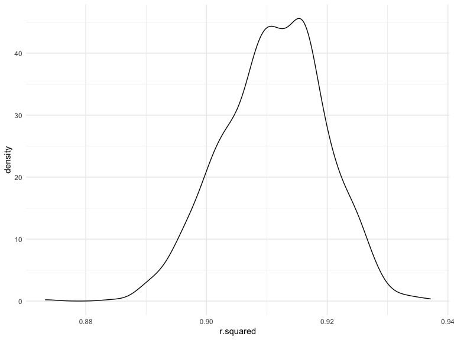
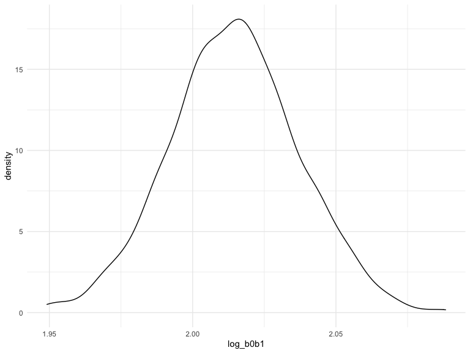
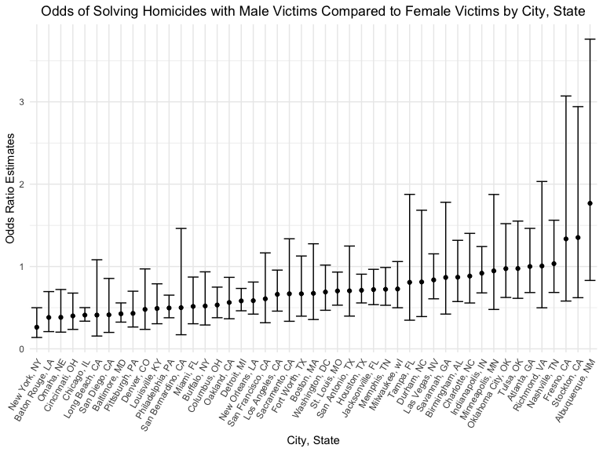

Homework 6
================
Emma Sexton <br>
Due 3 Dec 2022

``` r
library(tidyverse)
library(modelr)
```

## Problem 1

To obtain a distribution for $\hat{r}^2$, we’ll follow basically the
same procedure we used for regression coefficients: draw bootstrap
samples; the a model to each; extract the value I’m concerned with; and
summarize. Here, we’ll use `modelr::bootstrap` to draw the samples and
`broom::glance` to produce `r.squared` values.

``` r
weather_df = 
  rnoaa::meteo_pull_monitors(
    c("USW00094728"),
    var = c("PRCP", "TMIN", "TMAX"), 
    date_min = "2017-01-01",
    date_max = "2017-12-31") %>%
  mutate(
    name = recode(id, USW00094728 = "CentralPark_NY"),
    tmin = tmin / 10,
    tmax = tmax / 10) %>%
  select(name, id, everything())
```

    ## Registered S3 method overwritten by 'hoardr':
    ##   method           from
    ##   print.cache_info httr

    ## using cached file: ~/Library/Caches/R/noaa_ghcnd/USW00094728.dly

    ## date created (size, mb): 2022-09-29 11:01:00 (8.401)

    ## file min/max dates: 1869-01-01 / 2022-09-30

``` r
weather_df %>% 
  modelr::bootstrap(n = 1000) %>% 
  mutate(
    models = map(strap, ~lm(tmax ~ tmin, data = .x) ),
    results = map(models, broom::glance)) %>% 
  select(-strap, -models) %>% 
  unnest(results) %>% 
  ggplot(aes(x = r.squared)) + geom_density()
```



In this example, the $\hat{r}^2$ value is high, and the upper bound at 1
may be a cause for the generally skewed shape of the distribution. If we
wanted to construct a confidence interval for $R^2$, we could take the
2.5% and 97.5% quantiles of the estimates across bootstrap samples.
However, because the shape isn’t symmetric, using the mean +/- 1.96
times the standard error probably wouldn’t work well.

We can produce a distribution for $\log(\beta_0 * \beta1)$ using a
similar approach, with a bit more wrangling before we make our plot.

``` r
weather_df %>% 
  modelr::bootstrap(n = 1000) %>% 
  mutate(
    models = map(strap, ~lm(tmax ~ tmin, data = .x) ),
    results = map(models, broom::tidy)) %>% 
  select(-strap, -models) %>% 
  unnest(results) %>% 
  select(id = `.id`, term, estimate) %>% 
  pivot_wider(
    names_from = term, 
    values_from = estimate) %>% 
  rename(beta0 = `(Intercept)`, beta1 = tmin) %>% 
  mutate(log_b0b1 = log(beta0 * beta1)) %>% 
  ggplot(aes(x = log_b0b1)) + geom_density()
```



As with $r^2$, this distribution is somewhat skewed and has some
outliers.

The point of this is not to say you should always use the bootstrap –
it’s possible to establish “large sample” distributions for strange
parameters / values / summaries in a lot of cases, and those are great
to have. But it is helpful to know that there’s a way to do inference
even in tough cases.

## Problem 2

``` r
homicide_df <- 
  read_csv(
    'data/homicide-data.csv') %>%  
  janitor::clean_names()
```

``` r
homicide_summary <- 
  homicide_df %>% 
  mutate(
    city_state = str_c(city, sep = ", ", state),
    victim_age = as.numeric(victim_age),
    hom_solved = ifelse(disposition == "Closed by arrest", 1, 0)
  ) %>%
  filter(!(city_state %in% c("Tulsa, AL", "Dallas, TX", "Phoenix, AZ", "Kansas City, MO")),
         victim_race %in% c("White", "Black"))
```

### Run logistic regression for Baltimore, MD

``` r
baltimore_glm_df <- homicide_summary %>% 
  filter(city_state == "Baltimore, MD")

baltimore_glm_results <- 
  baltimore_glm_df %>% 
  glm(hom_solved ~ victim_age + victim_sex + victim_race, data = ., family = binomial())

baltimore_glm_results %>% 
  broom::tidy() %>% 
  mutate(odds_ratio = exp(estimate),
         lower_ci = exp(estimate - 1.96*std.error),
         upper_ci = exp(estimate + 1.96*std.error)
         ) %>% 
  select(term, odds_ratio, lower_ci, upper_ci) %>% 
  filter(term == "victim_sexMale") %>% 
  knitr::kable(col.names = c("Term", "Odds Ratio", "Lower 95% CI", "Upper 95% CI"), digits = 3)
```

| Term           | Odds Ratio | Lower 95% CI | Upper 95% CI |
|:---------------|-----------:|-------------:|-------------:|
| victim_sexMale |      0.426 |        0.325 |        0.558 |

### Run logistic regression for all City, States

We need to create a function to iterate across each `city_state` group.

``` r
glm_homicide <- function(homicide_summary) {
  
  glm(hom_solved ~ victim_age + victim_sex + victim_race, data = homicide_summary, family = binomial()) %>% 
    broom::tidy() %>% 
    mutate(
      odds_ratio = exp(estimate),
      lower_ci =   exp(estimate - 1.96*std.error),
      upper_ci =   exp(estimate + 1.96*std.error)
    ) %>% 
    select(term, odds_ratio, lower_ci, upper_ci) %>% 
    filter(term == "victim_sexMale")
  
}
```

Now we need to apply that function to nested lists for each
`city_state`.

``` r
homicide_data_analysis <- 
  homicide_summary %>% 
  select(city_state, everything()) %>% 
  nest(data = uid:hom_solved) %>% 
  mutate(glm_homicide_output = purrr::map(.x = data, ~ glm_homicide(.x))) %>% 
  unnest(cols = glm_homicide_output)
```

### Plot OR’s and CI’s for each City, State

``` r
homicide_data_analysis %>%
  ggplot(aes(x = reorder(city_state, odds_ratio), y = odds_ratio)) +
  geom_point() +
  geom_errorbar(aes(ymin = lower_ci, ymax = upper_ci)) +
  labs(
    title = , 
    x = "City, State",
    y = "Odds Ratio Estimates"
  ) +
  theme(
    axis.text.x = element_text(angle = 60, hjust = 1),
    legend.position = "none"
  )
```



The plot demonstrates that Albuquerque, NM, Stockton, CA, and Fresno, CA
have the highest odds of solving homicides with male victims compared to
female victims. Of note, the 95% confidence intervals for these cities
are extremely wide compared to the rest of the data set. Meanwhile, New
York, NY, Baton Rouge, LA, and Omaha, NE have the lowest odds of solving
homicides with male victims compared to female victims, and they have
tighter confidence intervals.

## Problem 3

### Load and Clean Data for Regression Analysis

Four variables (`babysex`, `frace`, `malform`, `mrace`) were converted
to factors since they are categorical. `frace` had no “unknown”
responses and `mrace` had no “other” responses, therefore, neither of
those responses were included in the factor recode. There are no other
missing data for any other variables in this data set. The `skimr`
function provides a summary of the variables in the data set below.

``` r
birthweight_df <- 
  read_csv(
    'data/birthweight.csv') %>%  
  janitor::clean_names() %>%
  mutate(
    babysex = factor(babysex, labels = c("male", "female")),
    frace =   factor(frace, labels = c("white", "black", "asian", "puerto rican", "other")),
    malform = factor(malform, labels = c("absent", "present")),
    mrace =   factor(mrace, labels = c("white", "black", "asian", "puerto rican"))
  )

skimr::skim(birthweight_df)
```

|                                                  |                |
|:-------------------------------------------------|:---------------|
| Name                                             | birthweight_df |
| Number of rows                                   | 4342           |
| Number of columns                                | 20             |
| \_\_\_\_\_\_\_\_\_\_\_\_\_\_\_\_\_\_\_\_\_\_\_   |                |
| Column type frequency:                           |                |
| factor                                           | 4              |
| numeric                                          | 16             |
| \_\_\_\_\_\_\_\_\_\_\_\_\_\_\_\_\_\_\_\_\_\_\_\_ |                |
| Group variables                                  | None           |

Data summary

**Variable type: factor**

| skim_variable | n_missing | complete_rate | ordered | n_unique | top_counts                              |
|:--------------|----------:|--------------:|:--------|---------:|:----------------------------------------|
| babysex       |         0 |             1 | FALSE   |        2 | mal: 2230, fem: 2112                    |
| frace         |         0 |             1 | FALSE   |        5 | whi: 2123, bla: 1911, pue: 248, asi: 46 |
| malform       |         0 |             1 | FALSE   |        2 | abs: 4327, pre: 15                      |
| mrace         |         0 |             1 | FALSE   |        4 | whi: 2147, bla: 1909, pue: 243, asi: 43 |

**Variable type: numeric**

| skim_variable | n_missing | complete_rate |    mean |     sd |     p0 |     p25 |     p50 |     p75 |   p100 | hist  |
|:--------------|----------:|--------------:|--------:|-------:|-------:|--------:|--------:|--------:|-------:|:------|
| bhead         |         0 |             1 |   33.65 |   1.62 |  21.00 |   33.00 |   34.00 |   35.00 |   41.0 | ▁▁▆▇▁ |
| blength       |         0 |             1 |   49.75 |   2.72 |  20.00 |   48.00 |   50.00 |   51.00 |   63.0 | ▁▁▁▇▁ |
| bwt           |         0 |             1 | 3114.40 | 512.15 | 595.00 | 2807.00 | 3132.50 | 3459.00 | 4791.0 | ▁▁▇▇▁ |
| delwt         |         0 |             1 |  145.57 |  22.21 |  86.00 |  131.00 |  143.00 |  157.00 |  334.0 | ▅▇▁▁▁ |
| fincome       |         0 |             1 |   44.11 |  25.98 |   0.00 |   25.00 |   35.00 |   65.00 |   96.0 | ▃▇▅▂▃ |
| gaweeks       |         0 |             1 |   39.43 |   3.15 |  17.70 |   38.30 |   39.90 |   41.10 |   51.3 | ▁▁▂▇▁ |
| menarche      |         0 |             1 |   12.51 |   1.48 |   0.00 |   12.00 |   12.00 |   13.00 |   19.0 | ▁▁▂▇▁ |
| mheight       |         0 |             1 |   63.49 |   2.66 |  48.00 |   62.00 |   63.00 |   65.00 |   77.0 | ▁▁▇▂▁ |
| momage        |         0 |             1 |   20.30 |   3.88 |  12.00 |   18.00 |   20.00 |   22.00 |   44.0 | ▅▇▂▁▁ |
| parity        |         0 |             1 |    0.00 |   0.10 |   0.00 |    0.00 |    0.00 |    0.00 |    6.0 | ▇▁▁▁▁ |
| pnumlbw       |         0 |             1 |    0.00 |   0.00 |   0.00 |    0.00 |    0.00 |    0.00 |    0.0 | ▁▁▇▁▁ |
| pnumsga       |         0 |             1 |    0.00 |   0.00 |   0.00 |    0.00 |    0.00 |    0.00 |    0.0 | ▁▁▇▁▁ |
| ppbmi         |         0 |             1 |   21.57 |   3.18 |  13.07 |   19.53 |   21.03 |   22.91 |   46.1 | ▃▇▁▁▁ |
| ppwt          |         0 |             1 |  123.49 |  20.16 |  70.00 |  110.00 |  120.00 |  134.00 |  287.0 | ▅▇▁▁▁ |
| smoken        |         0 |             1 |    4.15 |   7.41 |   0.00 |    0.00 |    0.00 |    5.00 |   60.0 | ▇▁▁▁▁ |
| wtgain        |         0 |             1 |   22.08 |  10.94 | -46.00 |   15.00 |   22.00 |   28.00 |   89.0 | ▁▁▇▁▁ |

### Regression Model Proposal

We hypothesize that birth weight (grams) is somewhat associated with the
mother’s weight at the time of delivery (pounds).

``` r
birthweight_df %>% 
  ggplot(aes(x = delwt, y = bwt)) +
  geom_point(alpha = 0.5)
```


To test this hypothesis, we will use a regression model using birth
weight and the mother’s weight at the time of delivery. Below,
predictions (x) and residuals (y) are used to illustrate the model.

``` r
fit_delwt <- lm(bwt ~ delwt, data = birthweight_df)

fit_delwt %>% 
  broom::tidy() %>% 
  knitr::kable(col.names = c("Term", "Estimate", "Standard Error", "Statistic", "P-Value"), digits = 3)
```

| Term        | Estimate | Standard Error | Statistic | P-Value |
|:------------|---------:|---------------:|----------:|--------:|
| (Intercept) | 2147.912 |         49.367 |    43.509 |       0 |
| delwt       |    6.639 |          0.335 |    19.804 |       0 |

``` r
birthweight_df %>% 
  mutate(
    modelr::add_residuals(birthweight_df, fit_delwt),
    modelr::add_predictions(birthweight_df, fit_delwt)
  ) %>% 
  ggplot(aes(x = pred, y = resid)) +
  geom_point() +
  labs(
    title = "Baby's Birth Weight by Mother's Weight at Delivery"
  )
```


### Fitting Comparison Models

The model above was compared with two models:

- One using length at birth (`blength`) and gestational age (`gaweeks`)
  as predictors (model = `fit_blength_gaweeks`)
- One using head circumference (`bhead`), length (`blength`), sex
  (`bsex`), and all interactions as predictors (model =
  `fit_bhead_blength_bsex`)

Comparison Models:

``` r
fit_blength_gaweeks = lm(bwt ~ blength + gaweeks, data = birthweight_df)

fit_bhead_blength_bsex = lm(bwt ~ bhead + blength + babysex + bhead*blength + bhead*babysex + blength*babysex + bhead*blength*babysex, data = birthweight_df)
```

### Comparing Regression Models using Cross-Validated Prediction Error

Using cross-validated prediction error, we are able to make comparisons
between these three models (`mod_blength`, `mod_blength_gaweeks`, and
`mod_bhead_blength_bsex`), as shown below.

``` r
cv_df <-
  crossv_mc(birthweight_df, 100) %>% 
  mutate(
    mod_delwt =              map(.x = train, ~lm(bwt ~ delwt, data = .x)),
    mod_blength_gaweeks =    map(.x = train, ~lm(bwt ~ blength + gaweeks, data = .x)),
    mod_bhead_blength_bsex = map(.x = train, ~lm(bwt ~ bhead + blength + babysex + bhead*blength + bhead*babysex + blength*babysex + bhead*blength*babysex, data = .x))
  ) %>% 
  mutate(
    rmse_delwt =              map2_dbl(.x = mod_delwt, .y = test, ~rmse(model = .x, data = .y)),
    rmse_blength_gaweeks =    map2_dbl(.x = mod_blength_gaweeks, .y = test, ~rmse(model = .x, data = .y)),
    rmse_bhead_blength_bsex = map2_dbl(.x = mod_bhead_blength_bsex, .y = test, ~rmse(model = .x, data = .y))
  )
```

### Plot of RMSE Values for Each Model

The plot below demonstrates the distribution of RMSE values for each
model. RMSE is a metric that ranges from 0 to infinity, and a lower
value represents a “better fitted” model.

``` r
cv_df %>% 
  select(starts_with("rmse")) %>% 
  pivot_longer(
    everything(),
    names_to = "model",
    values_to = "rmse",
    names_prefix = "rmse_"
  ) %>% 
  mutate(
    model = fct_inorder(model)
  ) %>% 
  ggplot(aes(x = model, y = rmse)) +
  geom_violin() +
  labs(
    title = "Root Mean Square Error Distributions for Each Model",
    x = "Model",
    y = "RMSE"
  ) +
  scale_x_discrete(labels = c("delwt" = "Mother's Weight at Delivery",
                              "blength_gaweeks" = "Baby's Length + Gestational Age",
                              "bhead_blength_bsex" = "Baby's Head Circ + Length + Sex")) +
  theme(
    plot.title = element_text(hjust = 0.5)
  )
```


With the lowest RMSE value of the three models, `bhead_blength_bsex`,
which considers head circumference, length, sex, and all interactions on
birth weight, is most appropriate. It should be noted, however, that
models with RMSE values between 0.2 and 0.5 indicate a relatively
accurate prediction model. Each model included in this analysis has an
extremely high RMSE value, therefore, these models may not be the most
accurate for assessing factors impacting birth weight.
